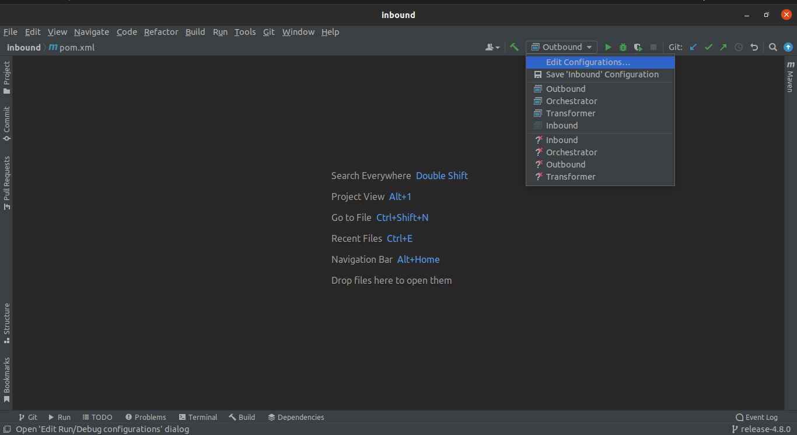
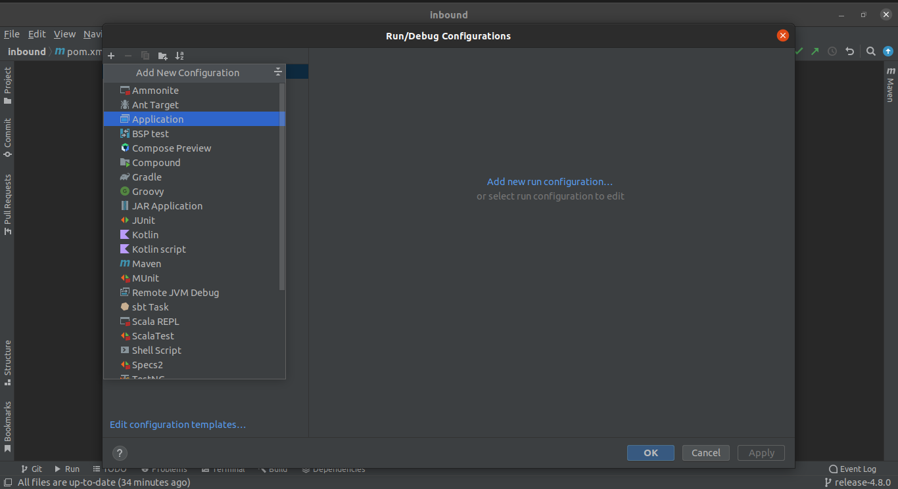
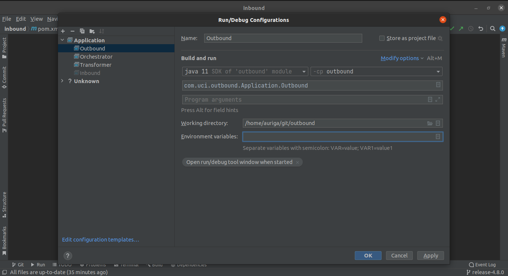
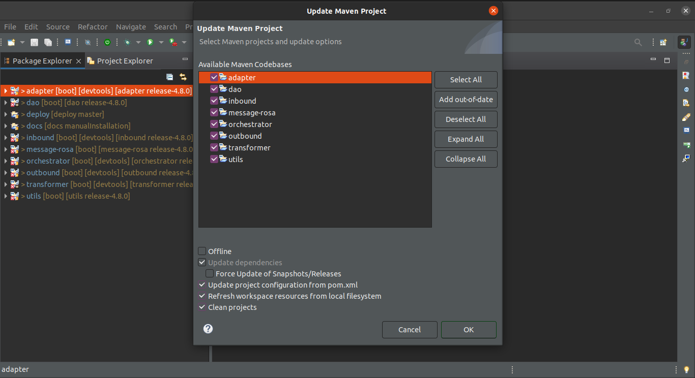
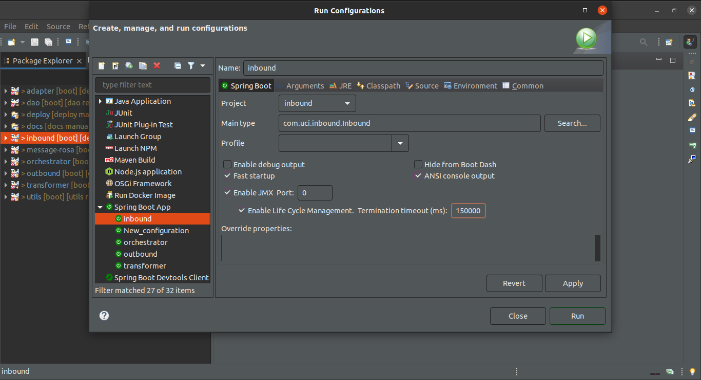

# Development environment

**Backend Setup**

**Setting up IDE**

**Environment variable setup**

**Build and Execute UCI**

**Debug services**

**Testing the API**

**Frontend Setup (Admin Console)**

**Frontend Setup (PWA)**

****

# Backend Setup

## Getting Started
## 1. Introduction

The Unified Communications Interface (UCI) aims to democratize the use of different communication channels such as WhatsApp, Telegram, SMS, email and more for governance use cases through a standard configurable manner that is reusable and scalable across all governance use cases.

## 2. Overview

This Document help you to Setup UCI (Unified Communications Interface) Project and test APIs on your local machine.

## 3. Prerequisite

1. Install Git

```
    $ sudo apt update
    $ sudo apt install git
```

2. Install Java 11

```
    $ sudo apt-get install openjdk-11-jdk
```

3. Install Docker

    * install docker using [docker](https://docs.docker.com/engine/install/ubuntu/) installation guide.

4. Install Cassandra

    * install cassandra using [cassandra](https://cassandra.apache.org/doc/latest/cassandra/getting\_started/installing.html) installation guide.

5. Install Maven

```
    $ sudo apt install maven
```

6. Lombok Enabled

    * Enable [lombok](https://www.baeldung.com/lombok-ide) in eclipse / STS / intelliJ.

7. Install IDE ([STS](https://spring.io/tools) / [Eclipse](https://www.eclipse.org/downloads/) / [IntelliJ](https://www.jetbrains.com/idea/download/))
8. Install [Postman](https://www.postman.com/downloads/) (for testing API)

9. Install Kafka, Zookeeper
    * install kafka using [kafka](https://www.onlinetutorialspoint.com/kafka/how-to-install-apache-kafka-on-ubuntu-18-04.html) installation guide.

10. Install Redis
    * Install Redis using installation [guide](https://www.digitalocean.com/community/tutorials/how-to-install-and-secure-redis-on-ubuntu-18-04).

11. Install Postgresql
    * Setup PostgreSQL using [Quickstart](https://www.postgresql.org/download/linux/ubuntu/) guide.


## 4. Setup

### 4.1 For first time :

1. Fork following repositories :

```
    https://github.com/samagra-comms/dao
    https://github.com/samagra-comms/utils
    https://github.com/samagra-comms/message-rosa
    https://github.com/samagra-comms/adapter
    https://github.com/samagra-comms/outbound
    https://github.com/samagra-comms/orchestrator
    https://github.com/samagra-comms/inbound
    https://github.com/samagra-comms/transformer
```

2. Clone all forked repositories

```
    git clone repository-link
```

3. Import all cloned repos into IDE
4. if project is not build by default then build using :

```
    $ mvn clean install -U 
```

5. Add [Enviorment Variable](https://github.com/samagra-comms/community/blob/main/use/docs/environment-variables.md) in IDE.

### 4.2 Routine :

1. Run spring boot application for following projects :
    * Inbound
    * Orchestrator
    * Transformer
    * Outbound


## 5. Testing API

### 5.1 For first time :

1. import following files to postman :

```
    Samagra Inbound - Apis.postman_collection
    Samagra Transformer - Apis.postman_collection
```

2. create new enviorment **inbound** with properties :

    | Variable |   Type  |  Initial Value |  Current Value |
    | :------: | :-----: | :------------: | :------------: |
    |  baseUrl | default | localhost:8085 | localhost:8085 |

3. create new enviorment **transformer** with following properties :

    | Variable |   Type  |  Initial Value |  Current Value |
    | :------: | :-----: | :------------: | :------------: |
    |  baseUrl | default | localhost:9091 | localhost:9091 |

### 5.2 Routine :

1. Test bot APIs with :

```
    Collections
    .
    └── Samagra Inbound - Apis 
                └── Bot - Messages
                        └── ...
```
# Setting up IDE
## 1. Overview 
In this doc we'll configure an IDE (Eclipse/IntelliJ) for setting up development enviorment for UCI.

## 2. Setting up IntelliJ

### 2.1 Importing Projects :

* <b>Import new project :</b>  
    ```
        File -> New -> Project from existing source  
    ```
    Then open project as <b>maven project</b> in IntelliJ.

* For importing multiple projects in intelliJ click on <b>maven</b> (in right toolbar) and click on <b>+</b> for opening multiple projects.  


* After importing all the projects in your IntelliJ, now reload all maven project for first time setup.


### 2.2 setting configurations

For setting configuration for any project follow below steps :

* Goto edit configuration. 


* Add new configuration of type Application.


* Now give name to config, select module, select JRE, give path of main class of that module, select working directory as shown in picture. 


* For handling enviorment variables, click on edit enviorment variables (if this colum not shown by default, enable it from <b>modify-options</b>).


* Make these configuration for following projects :  
inbound  
orchestrator  
transformer  
outbound  

### 2.3 Build and Run :

now we can build and Run the projects using below steps :

* Required Plugins to build the project :  
    maven  
    docker  
    lombok 

* Now simply select configuration and click on Run(Shift+F10), to run the project. 

## 3. Setting up Eclipse 

### 3.1 Importing Projects :

* <b>Import Projects into Eclipse :</b>
```
    File 
        -> Import 
            -> Projects From Git 
                -> Existing Local Repository 
                    -> Select You project
                        -> Finish
```
Import all the project like this.

* After Importing, Update all project for first time setup.
```
    Project
        -> Update Maven Project
            -> Select All Projects
                -> Update
```  



### 3.2 setting configurations

For setting configuration for any project follow below steps :

* Make new Configuration for spring-boot-app
```
Run
    -> Run Configurations
        -> Spring Boot App
```

* Now give name to config, select project, select main class of project and click Apply.  


* Now for handling Enviorment Variables click on Enviorment in config window.  
Here we can put enviorment variable's value.


* Make these configuration for following projects :  
inbound  
orchestrator  
transformer  
outbound

### 3.3 Build and Run :

To build and Run in Eclipse, Simply Run the project as Spring Boot App.
```
Run
    -> Run As
        -> Spring Boot App
```

# Enviroment variable setup

## 1. Add enviorment variable in IDE

### 1.1 Kafka
Kafka is used to build real-time streaming data pipelines and real-time streaming applications. A data pipeline reliably processes and moves data from one system to another, and a streaming application is an application that consumes streams of data.

we use XMessage to converse between our services, It is sent to Kafka topics. Then
different services consume these XMessages from Kafka and process further.  

* Setup Kafka with [quickstart](https://kafka.apache.org/quickstart) guide.
* Generate the following Kafka topics and add following values :
```
    BOOTSTRAP_SERVERS = # Kafka bootstrap server host/IP
    REGISTRY_URL = # Schema Registry URL generated from kafka
    # kafka topics for sending and receiving XMessage from our services
    KAFKA_CAMPAIGN_TOPIC=campaign
    KAFKA_INBOUND_ERROR_TOPIC=inbound-error
    KAFKA_INBOUND_GS_OPTED_OUT_TOPIC=gs-opted-out
    KAFKA_INBOUND_PROCESSED_TOPIC=inbound-processed
    KAFKA_INBOUND_UNPROCESSED_TOPIC=inbound-unprocessed
    KAFKA_LOGS_TOPIC=uci-telemetry-logs
    KAFKA_ODK_TRANSFORMER_TOPIC=com.odk.transformer
    KAFKA_ODK_TRANSFORMER_TOPIC_PATTERN=com.odk.*
    KAFKA_OUTBOUND_TOPIC=outbound
    KAFKA_TELEMETRY_TOPIC=telemetry
```

### 1.2 Redis :
We are using Redis for caching the latest XMessage sent/received by user. We would be further using this for caching other elements.

* Host Redis Using Redis [Quickstart](https://redis.io/topics/quickstart) and add below values :
```
    REDIS_DB_INDEX = # Database Index
    REDIS_HOST = # Redis Host
    REDIS_PORT = # Redis port
```

### 1.3 ODK (Open Data Kit):
ODK is being used to define the flow/logic of a bot. use this link [ODK](https://docs.getodk.org/aggregate-digital-ocean/) to set up and generate its credentials.
```
    ODK_PASS = # ODK Passowrd
    ODK_URL = # ODK URL
    ODK_USER = # ODK Username
```

### 1.4 FusionAuth :
Fusion Auth is being used to store and Authenticate user data it also stores the user consent to fetch its data (in decrypted form). Deploy Fusion Auth with installation [Guide](https://fusionauth.io/docs/v1/tech/installation-guide/docker).

* Generate Fusion Auth Key and Url using [Documentation](https://fusionauth.io/docs/v1/tech/apis/keys#generate-a-key).

```
    FUSIONAUTH_KEY = # Generated Fusion Key
    FUSIONAUTH_URL = # Generated Fusion URL
```

### 1.5 Assessment answer comparison characters :
We are using assessment characters to go to the previous state or restart the conversation. 

```
    # To restart the bot
    ASSESSMENT_GO_TO_START_CHAR=*
    # To go back to the previous state
    ASSESSMENT_ONE_LEVEL_UP_CHAR=#
```

### 1.6 Caffeine :
Caffeine is a high-performance Java 8 based caching library providing a near-optimal hit rate. It provides an in-memory cache very similar to the Google Guava API.     

Caffeine is being used to cache all the API calls to [federation service](https://github.com/samagra-comms/uci-apis/). 

```
    CAFFEINE_CACHE_EXPIRE_DURATION=300
    CAFFEINE_CACHE_MAX_SIZE=0
```

### 1.7 Postgresql :
PostgreSQL is an advanced, enterprise-class, and open-source relational database system. PostgreSQL supports both SQL (relational) and JSON (non-relational) querying.

It is being used to store the question and assessment data and respective to ODK form questions.  

* Setup postgreSQL using [guide](https://zhao-li.medium.com/getting-started-with-postgresql-using-docker-compose-34d6b808c47c).
* Create a new Database and add the following values :
```
    FORMS_DB_HOST = # Database Host
    FORMS_DB_NAME = # Database Name
    FORMS_DB_USERNAME = # Database Username
    FORMS_DB_PASSWORD = # Database Password
    FORMS_DB_PORT = # Port
    FORMS_DB_URL = # Database URL
```


### 1.8 Netcore  :
Netcore is a service provider which is being used to sent/receive messages from the user for various channels (Whats App, Telegram, etc.)

Please contact the Netcore administrator to  get these details
```
    NETCORE_WHATSAPP_AUTH_TOKEN = # Authentication Token 
    NETCORE_WHATSAPP_SOURCE = # Source ID for sending messages to Netcore 
    NETCORE_WHATSAPP_URI = # Netcore API Base URL
```

### 1.9 Cassandra :

Cassandra is one of the most efficient and widely-used NoSQL databases. One of the key benefits of this system is that it offers highly-available service and no single point of failure.

Cassandra is being used to store XMessages.

deploy Apache [Cassandra](https://hub.docker.com/r/bitnami/cassandra/) and add below values
```
    CASSANDRA_KEYSPACE = # Keyspace name
    CASSANDRA_PORT = # Cassandra Port
    CASSANDRA_URL = # Cassandra URL
```

### 1.10 Campaign URL and token :
To connect to [federation service](https://github.com/samagra-comms/uci-apis/) API use the below details:

Generate campaign admin token using [uci-apis](https://github.com/samagra-comms/uci-apis) project.

```
    CAMPAIGN_ADMIN_TOKEN = # Authentication token
    CAMPAIGN_URL = # federation service base URl
```

### 1.12 Transport Socket Base URL :
Outbound base URL for Diksha service provider. We can generate Transport Socket Base URL with [transport-socket](https://github.com/samagra-comms/transport-socket/tree/uci-pwa) Project
```
    # Sunbird Adapater Outbound URL
    TRANSPORT_SOCKET_BASE_URL = # Transport Socket Base URL
```

### 1.13 Telemetry
we are sending events to telemetry for exhaust generation, the telemetry specs being used is [here](https://github.com/sunbird-specs/Telemetry/blob/master/learn/specification.md).  
the PData is a unique id assigned to this component

```
    TELEMETRY_EVENT_PDATA_ID = # Telemetry Exhaust PDATA
```

### 1.14 Other enviorment variables :
```
    # In which enviorment we are working
    ENV = dev 
    WEBCLIENT_HTTP_REQUEST_TIMEOUT = 5
```

# Testing the API


# Debug services

### 1. Overview
A service can be debugged via a IDE tool if you are using one to run the services or via checking the docker conatiner logs if you are using the docker image to run it.

### 2. Order of debugging services

To debug any issue or error, follow below order. We should check the service in this order as the message processes in this order only.

1. Inbound
2. Orchestrator
3. Transformer
4. Outbound

A message will be first received in the inbound service to convert the message to XMessage format then it will be sent to the kafka topic which is being listened by the orchestrator service. To check the build/execution flow of the services [click chere](https://github.com/samagra-comms/community/blob/main/use/docs/build-execution-flow.md).

### 3. Debug on IDE Tool

When a service is started from a IDE tool, it will also show the logs associated with the service. If you are not receiving message reply or the service is not starting, please see the logs to check the issue, and work on the solution accordingly.

You can also add debugger to the IDE tool to add break points in the code to check where the issues is generating from. If you don't know how to, check below videos for reference.

* How to add debugger in [Spring boot tool](https://www.youtube.com/watch?v=w5woL3znVuA)
* How to add debugger in [intellij](https://www.youtube.com/watch?v=1bCgzjatcr4)

### 4. Debug for Docker Image

If you have started the services using docker images, you should follow below steps to debug them.

**1. Check All Services logs**

* Run command below to check logs for all the running services.

    `docker-compose logs --follow --tail 10`

**2. Check Single Service logs**

* If you are sure about the service which is giving error, we can check the logs for that particular service. First check the container id by running the command below.

    `docker ps`

It will return a list of running containers. Each container has a container id as shown in the image.


* To check logs for the container, run command

    `docker logs --follow --tail 10 container_id`

To check the logs for kafka/redis etc services, you should follow the above steps.

#### 5. Common mistakes or errors

1. Missing environment variables
2. Connection issues with kafka/cassandra/postgresql etc.
3. Port in use by another service.
4. Java version conflict

# Build and Execute UCI

### 1. Overview
UCI has a total of 8 repositories which are being used to process the bot messages from inbound to outbound. We have 4 main repositories who will process the messages from receiving the messages from channel(Sms/Whatsapp), converting the message to xmessage, authenticating the user, producing the next message, converting it back to message format for channel and sending it to the channel(Sms/Whatsapp). The other repositories are the helper repositories with each doing different jobs. 

### 2. Build Flow
The repositories should be built & then executed in the sequence mentioned below.


#### 1. Utils

Utils communicate with the federation service via apis. It holds all the utility/helper classes which will be used in other repositories. To clone this git repository use [link](https://github.com/samagra-comms/utils). Once the repository is cloned, build it using the command below. 

```
    mvn clean install -DskipTests
```
#### 2. Message Rosa
Message Rosa holds all the core models for XMessage & its property fields. To clone this git repository use [link](https://github.com/samagra-comms/message-rosa). Once the repository is cloned, build it using the command below.
```
    mvn clean install -DskipTests
```
#### 3. Dao
Dao holds the dao & repository classes for XMessage. To clone this git repository use [link](https://github.com/samagra-comms/dao). Once the repository is cloned, build it using the command below.
```
    mvn clean install -DskipTests
```
#### 4. Adapter
Adapters convert information provided by channels (SMS, Whatsapp) for each specific provider to xMessages and vice versa. Adapters are gateway to the external services and are responsible for receiving user response and sending the response to users. To clone this git repository use [link](https://github.com/samagra-comms/adapter). Once the repository is cloned, build it using the command below.
```
    mvn clean install -DskipTests
``` 
#### 5. Inbound
Inbound receives the messages from a channel, and uses the channel adapter to convert it to XMessage format. Once the message is converted, it will be pushed to the kafka topic, the orchestrator will listen to this topic to further process it. To clone this git repository use [link](https://github.com/samagra-comms/inbound). Once the repository is cloned, build it using the command below.
```
    mvn clean install -DskipTests
``` 
We can use any IDE tool to run it on a local machine or use docker to create its image & then run it on any server/local.
1. Create docker image
```
    docker build -t samagragovernance/inbound:${CURRENT_VERSION} .
```
2. Push docker image to docker hub
```
    docker push samagragovernance/inbound:${CURRENT_VERSION}
```
3. Run docker image
```
    docker-compose -f docker-compose.yml up -d inbound
```
#### 6. Orchestrator
Orchestrator authenticates & processes the user data from whom the message is received. The XMessage will then be pushed to the kafka topic, the transformer will listen to this topic to further process it. To clone this git repository use [link](https://github.com/samagra-comms/orchestrator). Once the repository is cloned, build it using the command below.
```
    mvn clean install -DskipTests
``` 
We can use any IDE tool to run it on a local machine or use docker to create its image & then run it on any server/local.
1. Create docker image
```
    docker build -t samagragovernance/orchestrator:${CURRENT_VERSION} .
```
2. Push docker image to docker hub
```
    docker push samagragovernance/orchestrator:${CURRENT_VERSION}
```
3. Run docker image
```
    docker-compose -f docker-compose.yml up -d orchestrator
```
#### 7. Transformer
Transformers transforms the previous xMessage from the user to one that needs to be sent next. It is a microservice that returns a new xMessage based on the previous user action, which will then be shown to the user. The XMessage will be pushed to the kafka topic, the outbound will listen to this topic to further process it. To clone this git repository use [link](https://github.com/samagra-comms/transformer). Once the repository is cloned, build it using the command below.
```
    mvn clean install -DskipTests
``` 
We can use any IDE tool to run it on a local machine or use docker to create its image & then run it on any server/local.
1. Create docker image
```
    docker build -t samagragovernance/transformer:${CURRENT_VERSION} .
```
2. Push docker image to docker hub
```
    docker push samagragovernance/transformer:${CURRENT_VERSION}
```
3. Run docker image
```
    docker-compose -f docker-compose.yml up -d transformer
```
#### 8. Outbound
Outbound converts the xMessage to the one that will be sent to the channel(sms/whatsapp). It will then be sent to the network provider(Netcore/Gupshup) who will send it to the channel. To clone this git repository use [link](https://github.com/samagra-comms/outbound). Once the repository is cloned, build it using the command below.
```
    mvn clean install -DskipTests
``` 
We can use any IDE tool to run it on a local machine or use docker to create its image & then run it on any server/local.
1. Create docker image
```
    docker build -t samagragovernance/outbound:${CURRENT_VERSION} .
```
2. Push docker image to docker hub
```
    docker push samagragovernance/outbound:${CURRENT_VERSION}
```
3. Run docker image
```
    docker-compose -f docker-compose.yml up -d outbound
```


# Frontend Setup (Admin Console)

# Frontend Setup (PWA)